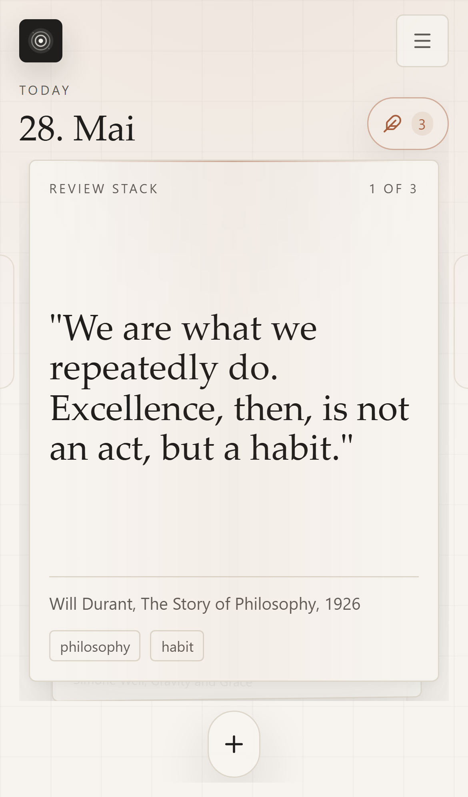
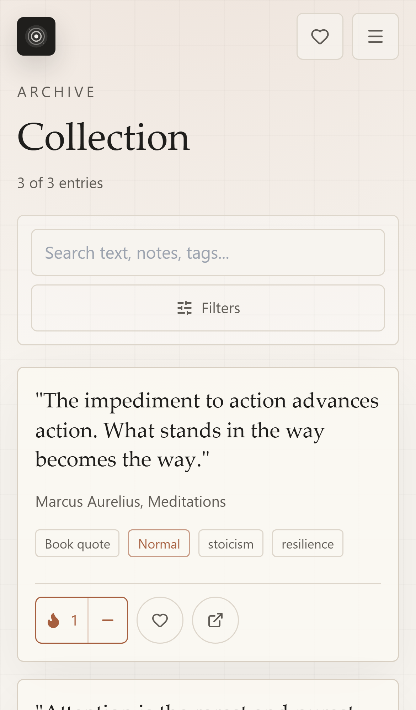
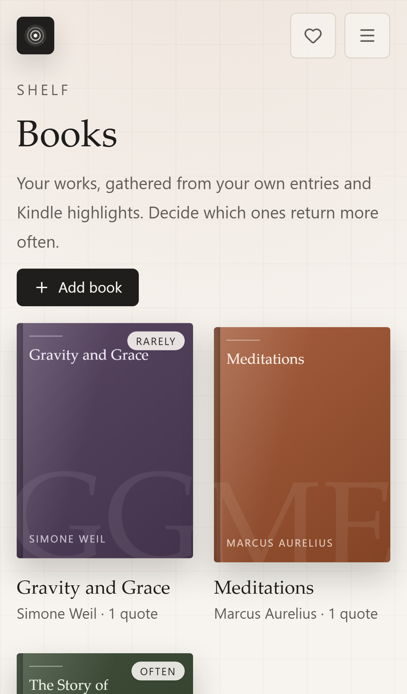
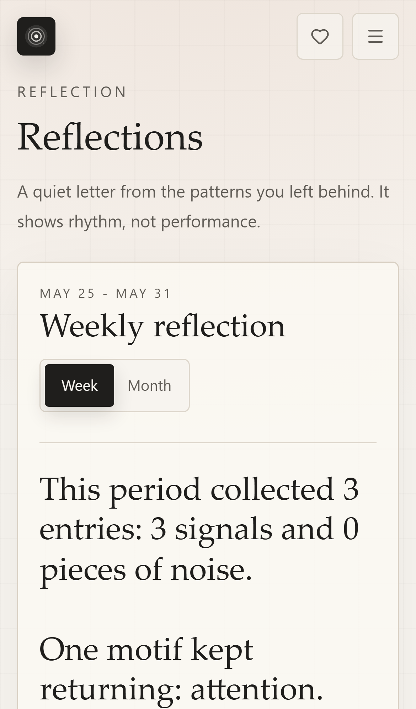

# Quiet Signal

**A free, local-first, privacy-first commonplace app for notes, quotes, and recurring insights.**

Most highlights and notes disappear into an archive you never open again. Quiet Signal helps you collect thoughts, quotes, photos, and voice notes — and quietly *resurfaces* the ones that matter, so you actually revisit them.

It's a [Readwise](https://readwise.io)-style review flow for your *own* thoughts — without an account, a subscription, a cloud, or any tracking. Everything stays in your browser.

> **Live app:** https://quiet-signal.vercel.app · **Tagline:** *Ruhig sammeln. Klar behalten.*

<p align="center">
  
  
  
  
</p>

## Why?

- You collect quotes, ideas, and highlights — but rarely look at them again.
- You want the "resurface what matters" habit of Readwise, but **local-first and private**.
- You don't want yet another cloud account, subscription, or analytics SDK watching your notes.

Quiet Signal is built around a simple metaphor: capture the **noise**, keep the **signal**.

## Features

- **Capture anything** — text, photos, and voice notes, in seconds.
- **Triage flow** — new captures land in *Rauschen* (noise); a calm swipe deck lets you keep, snooze, or discard them into *Signal*.
- **Daily review** — a spaced-repetition deck resurfaces your signals over time (weighted by how much they matter to you).
- **Books & sources** — group quotes by book, tune how often a book resurfaces.
- **Reflections** — a quiet weekly/monthly letter built from your own signals.
- **Import & export** — import **Kindle** clippings and **Readwise CSV**; export everything as **JSON, CSV, or Markdown**. Your data is always yours.
- **Private by design** — no account, no cloud, no tracking. Optional **PIN lock** and **AES-GCM vault encryption** for your entries.
- **Installable PWA** — works offline, "Add to Home Screen", share-target support.
- **Multilingual** — German, English, Spanish, French.

## Who is it for?

Readers, writers, students, researchers, Obsidian/PKM folks, and anyone who likes the Readwise idea but wants their highlights **local and private** instead of in someone else's cloud.

Not a Notion/Obsidian replacement — more a small, focused companion for the things you actually want to remember.

## How your data is stored

Everything lives in your browser's **IndexedDB** (via [Dexie](https://dexie.org/)). There is **no backend** — the app is a static PWA. Settings live in `localStorage`. Nothing is sent anywhere. Move your library anytime via JSON/CSV/Markdown export.

## Quickstart

**Just use it:** open https://quiet-signal.vercel.app and (optionally) install it via your browser's "Add to Home Screen".

**Run it locally:**

```bash
git clone https://github.com/ES-92/quiet-signal.git
cd quiet-signal
npm install
npm run dev      # http://127.0.0.1:5173
```

**Build for production:**

```bash
npm run build    # tsc + vite build
npm run preview
```

## Tech stack

React 19 · TypeScript · Vite · TailwindCSS · Zustand · Dexie (IndexedDB) · vite-plugin-pwa. No server, no database to host.

## Roadmap

- Richer reflections and pattern views
- More import sources
- Polished gesture discoverability
- (Your ideas — open an issue or a discussion!)

This project intentionally stays **free and local**. There is no paid tier; cloud sync is deliberately out of scope.

## Support

Quiet Signal is free and will stay free. If it helps you build a better reading or reflection habit, you can support its development:

- ☕ [Ko-fi](https://ko-fi.com/esc92)
- 💳 [PayPal](https://paypal.me/ErikSchroeder92)

Donations help with maintenance, documentation, and new import/export integrations. No pressure — using and sharing the app helps just as much.

## Contributing

Issues, ideas, and PRs are welcome — see [CONTRIBUTING.md](CONTRIBUTING.md). Please also read the [Code of Conduct](CODE_OF_CONDUCT.md).

## License

[MIT](LICENSE) © 2026 Erik Schröder
